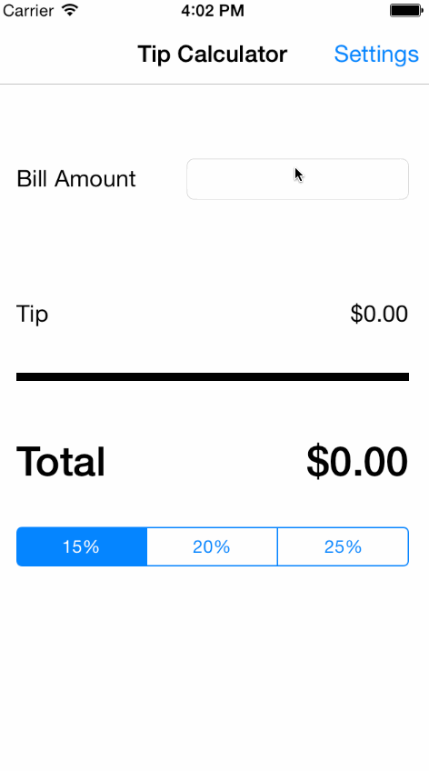

codepath-tipcalculator
======================

A basic tip calculator

1. How many hours did it take to complete: ~5 hours
2. Features implemented: Required features + optional settings page for setting default tip percentage

